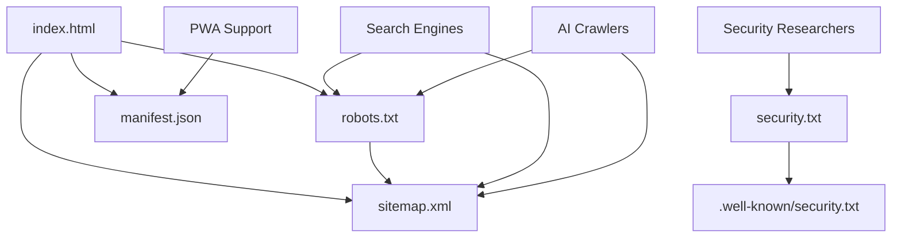

# Index of Essential Files for Labstack.in

This document provides a comprehensive index of all essential files for SEO, security, and production deployment.

## 📍 Quick Reference

| File | Location | Purpose | Status |
|------|----------|---------|--------|
| robots.txt | `/robots.txt` | Crawler rules | ✅ |
| sitemap.xml | `/sitemap.xml` | URL structure | ✅ |
| humans.txt | `/humans.txt` | Team credits | ✅ |
| security.txt | `/security.txt` | Security policy | ✅ |
| security.txt | `/.well-known/security.txt` | RFC location | ✅ |
| manifest.json | `/manifest.json` | PWA config | ✅ |
| favicon.png | `/favicon.png` | App icon | ✅ |
| change-password | `/.well-known/change-password` | Password redirect | ✅ |

---

## 📂 Directory Structure

```
public/
├── robots.txt                     ← Crawler instructions
├── sitemap.xml                    ← Complete site map
├── humans.txt                     ← Team & tech info
├── security.txt                   ← Security policy
├── manifest.json                  ← PWA configuration
├── favicon.png                    ← App icon
├── india-map.png                  ← Map visualization
├── .well-known/
│   ├── security.txt              ← RFC 9116 compliant
│   ├── change-password           ← W3C standard
│   └── README.md                 ← Well-known docs
└── uploads/
    └── 97d6ae42-...png           ← OG image

Documentation/
├── PRODUCTION_CHECKLIST.md        ← Launch checklist
├── SEO_AEO_IMPLEMENTATION_COMPLETE.md ← Full report
└── INDEX_OF_FILES.md              ← This file
```

---

## 🌐 Public Endpoints

All files are accessible at root domain:

```
https://labstack.in/robots.txt
https://labstack.in/sitemap.xml
https://labstack.in/humans.txt
https://labstack.in/security.txt
https://labstack.in/manifest.json
https://labstack.in/.well-known/security.txt
https://labstack.in/.well-known/change-password
```

---

## 🔍 File Purposes

### robots.txt
- **What:** Crawler access rules
- **Who needs it:** Search engines, AI crawlers
- **Update frequency:** When adding/removing pages
- **Content:** Allow/Disallow rules, Sitemap location

### sitemap.xml
- **What:** Complete page inventory
- **Who needs it:** Search engines
- **Update frequency:** When adding new pages
- **Content:** URLs, priorities, change frequencies

### humans.txt
- **What:** Human-readable site info
- **Who needs it:** Developers, researchers
- **Update frequency:** When team changes
- **Content:** Team, tech stack, mission

### security.txt
- **What:** Security vulnerability reporting
- **Who needs it:** Security researchers
- **Update frequency:** Annually (expires 2026-12-31)
- **Content:** Contact info, policy, scope

### manifest.json
- **What:** Progressive Web App config
- **Who needs it:** Browsers, mobile devices
- **Update frequency:** When app details change
- **Content:** Name, icons, colors, shortcuts

### .well-known/
- **What:** Standard URI location
- **Who needs it:** Automated systems
- **Update frequency:** As needed
- **Content:** security.txt, change-password

---

## 🎯 SEO File Relationships



---

## 📋 Maintenance Schedule

### Daily
- Monitor for security reports

### Weekly
- Check sitemap accessibility
- Review blog publication dates

### Monthly
- Update blog dates in sitemap
- Review robots.txt effectiveness

### Quarterly
- Audit all public files
- Test PWA functionality
- Review security policy

### Annually
- Update security.txt expiry
- Refresh humans.txt
- Review all documentation

---

## 🧪 Testing Commands

```bash
# Check robots.txt
curl https://labstack.in/robots.txt

# Check sitemap.xml
curl https://labstack.in/sitemap.xml

# Check humans.txt
curl https://labstack.in/humans.txt

# Check security.txt
curl https://labstack.in/security.txt
curl https://labstack.in/.well-known/security.txt

# Check manifest.json
curl https://labstack.in/manifest.json

# Validate sitemap
# Use: https://www.xml-sitemaps.com/validate-xml-sitemap.html

# Test PWA
# Use: Lighthouse in Chrome DevTools
```

---

## 📊 File Sizes (Approximate)

| File | Size | Compression |
|------|------|-------------|
| robots.txt | 2 KB | gzip |
| sitemap.xml | 15 KB | gzip |
| humans.txt | 1 KB | gzip |
| security.txt | 2 KB | gzip |
| manifest.json | 2 KB | gzip |
| favicon.png | 5 KB | - |

**Total overhead:** ~27 KB (gzipped: ~15 KB)

---

## 🔗 Related Documentation

- **Production Checklist:** `PRODUCTION_CHECKLIST.md`
- **Full SEO Report:** `SEO_AEO_IMPLEMENTATION_COMPLETE.md`
- **Well-known Files:** `public/.well-known/README.md`
- **Main README:** `README.md`

---

## 📞 Questions?

**Technical Issues:**
- Email: contact@labstack.in

**Security Concerns:**
- Email: contact@labstack.in (Subject: Security Vulnerability Report)

**Documentation:**
- See: PRODUCTION_CHECKLIST.md

---

## ✅ Verification Checklist

Before going live, verify:

- [ ] All files return HTTP 200
- [ ] robots.txt has no syntax errors
- [ ] sitemap.xml validates
- [ ] security.txt has not expired
- [ ] manifest.json is valid JSON
- [ ] Favicon displays correctly
- [ ] .well-known/ is accessible

---

**Last Updated:** January 24, 2025  
**Status:** ✅ Production Ready  
**Version:** 1.0.0